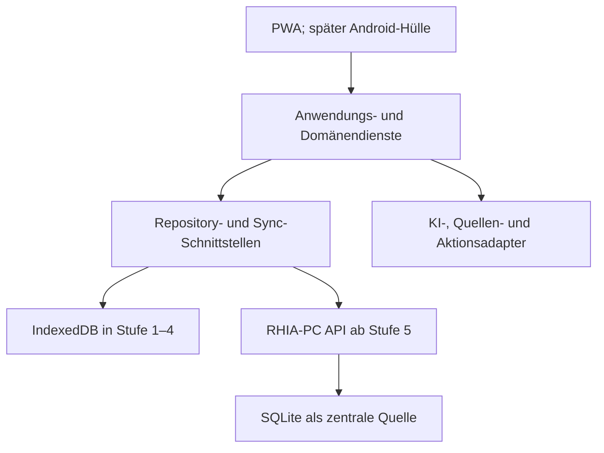

# RHIA 2.0 – verbindlicher Master-Aufbauplan 2.2

**Planversion:** 2.2  
**Freigegebene Planbasis:** 09.08.2026  
**Projekt:** RHIA – RH Intelligent Assistant  
**Aktives Repository:** `GGRLAK-04872/RHIA-2`  
**Letzte Konsolidierung:** 10.08.2026 – Stufe 3 vollständig abgeschlossen  
**Freigabestatus:** Stufen 0 bis 3 abgeschlossen; Stufe 4 am 10.08.2026 ausdrücklich freigegeben

## 1. Zweck und Geltung

Dieser Masterplan enthält ausschließlich die langfristig stabilen Vorgaben für RHIA 2.0. Der letzte
verifizierte Funktionsstand auf `main`, der spätere Dokumentationsstand, der letzte Teststand,
offene Punkte, Sperren und der nächste Arbeitsschritt stehen ausschließlich in
`docs/RHIA_START_HERE.md`.

Der Funktionsstand bezeichnet den letzten technisch geprüften Entwicklungsstand. Spätere reine
Änderungen an Übergabe- oder Planungsdateien gehören zum Dokumentationsstand und verändern den
Funktionsstand nicht.

Für einen neuen Arbeitschat sind genau diese zwei aktiven Projektdokumente erforderlich:

1. `docs/RHIA_MASTER_AUFBAUPLAN_2.2.md` – dauerhafter Plan und unveränderbare Regeln;
2. `docs/RHIA_START_HERE.md` – lebender Projektstand und aktueller Haltepunkt.

Alte Masterpläne, Chat-Backups, Stufenprotokolle, Abnahmen und Statusdateien dürfen als Historie
erhalten bleiben. Sie sind nicht Bestandteil des normalen Chatstarts und dürfen keinen neueren
Stand aus `RHIA_START_HERE.md` überschreiben.

Bei Widersprüchen gilt diese Rangfolge:

1. eine ausdrückliche neuere Entscheidung von Sir;
2. der tatsächlich verifizierte Stand von `GGRLAK-04872/RHIA-2`;
3. `docs/RHIA_START_HERE.md` für den aktuellen Projektstand;
4. dieser Masterplan für langfristige Architektur und Regeln;
5. aktuelle ADRs und Abnahmeunterlagen im Repository;
6. ältere RHIA-2-Dokumente ausschließlich als Historie;
7. das alte Repository `GGRLAK-04872/RHIA` ausschließlich als historische Referenz.

Dieser Plan ist keine Freigabe für eine Entwicklungsstufe. Eine gesperrte Stufe darf niemals aus
dem Plantext heraus begonnen werden.

## 2. Projektziel

RHIA wird als persönliche, kontrollierbare und möglichst lokal betriebene Assistentin für Sir
aufgebaut. Sie soll die Bereiche Privat, RH Produktion, RHIA und Shadow Grown zusammenführen.

RHIA soll langfristig:

- bestätigtes Wissen strukturiert, quellengebunden und nachvollziehbar speichern;
- Korrekturen und Widersprüche sichtbar behandeln, statt Inhalte still zu überschreiben;
- Projekte, Ziele, Aufgaben, Termine, Entscheidungen und Abhängigkeiten verwalten;
- Prioritäten verständlich erklären und manuelle Entscheidungen von Sir erhalten;
- Tages- und Wochenpläne sowie Briefings vorschlagen;
- Schutzzeit für RHIA und Shadow Grown berücksichtigen;
- freigegebene Kalender, Dateien, E-Mails und Kontakte kontrolliert einbeziehen;
- wichtige Ereignisse passend melden, ohne Benachrichtigungsflut zu erzeugen;
- Entwürfe und Aktionspläne vorbereiten;
- externe Änderungen nur innerhalb einer gültigen Freigabe ausführen;
- auf einem eigenen RHIA-PC als zentrale Instanz laufen;
- sicher von Android-Tablet, Android-Handy und Browser erreichbar sein;
- später Sprache, Wake-Word, Android-App und den RHIA-Organismus erhalten;
- ohne unnötige laufende Infrastruktur- oder KI-Kosten funktionieren.

Verbindlicher Grundsatz:

> Kontrolle vor Autonomie. Local-first vor Cloud-Abhängigkeit. Kernfunktion vor Optik und
> Sprache. Genau eine erkennbare Quelle der Wahrheit.

### 2.1 Definition von RHIA v1.0

RHIA v1.0 ist erreicht, wenn mindestens:

1. Gedächtnis v1 zuverlässig arbeitet;
2. Projekte, Ziele und Aufgaben strukturiert verwaltet werden;
3. Priorisierung und Tages-/Wochenplanung nachvollziehbar funktionieren;
4. der RHIA-PC die zentrale Quelle der Wahrheit ist;
5. Tablet und Handy sicher mit dieser Quelle synchronisieren;
6. Export, Backup und Restore real getestet sind;
7. mindestens der Kalender als erste produktive Datenquelle lesend angebunden ist;
8. Freigabe-, Audit- und Fehlerregeln funktionieren;
9. Kosten sichtbar kontrolliert werden;
10. Sir alle vorgesehenen Praxistests bestätigt hat.

Sprache, finale Optik und Spezialmodule sind für den Kernnachweis von v1.0 nicht erforderlich.

## 3. Unveränderbare Vorgaben von Sir

- Standardanrede ist `Sir`; privat darf `Mike` verwendet werden.
- Das spätere Wake-Word lautet `Rhia`; die Aktivierungsantwort lautet `Ja, Sir?`.
- Der Sprach-Ruhemodus beginnt nach drei Minuten Inaktivität.
- RHIA darf Vorschläge machen, aber geschützte Entscheidungen nicht selbstständig ändern.
- Projekte werden zuerst nach Termin, dann nach Wichtigkeit priorisiert.
- Geldpotenzial und früherer realistischer Geldeingang werden bevorzugt; Effizienz und möglicher
  Gesamtgewinn sind gegeneinander abzuwägen.
- Ungefähr 20 Prozent der verfügbaren Projektzeit werden als Schutzzeit für RHIA und Shadow Grown
  vorgeschlagen.
- Mindestens ein Block pro Woche ist für jedes dieser beiden Projekte vorzusehen; bevorzugt 60
  Minuten, ersatzweise zweimal 30 Minuten.
- Lokale oder offline betreibbare Lösungen haben Vorrang.
- Laufende Credits und unnötige Abonnements sind zu vermeiden. Kostenpflichtige Technik wird nur
  eingesetzt, wenn sie unvermeidbar, vorher erklärt und ausdrücklich freigegeben ist.
- Der vorhandene OpenAI-API-Schlüssel wird später sicher wiederverwendet. Es wird kein neuer
  Schlüssel erstellt, solange Sir dies nicht ausdrücklich verlangt.
- RHIA darf keine Sicherheits-, Datenschutz- oder Kostenentscheidung umgehen.
- Fehler werden sofort sichtbar gemeldet. Ein gescheiterter Weg wird nicht als Erfolg ausgegeben.
- Das alte Repository `GGRLAK-04872/RHIA` darf nicht verändert werden.
- Eine spätere Stufe beginnt ausschließlich nach ausdrücklicher Freigabe durch Sir.

## 4. Gesamtarchitektur

RHIA 2.0 bleibt ein modularer Monolith in einem TypeScript-Monorepository. Zusätzliche lokale
Dienste werden nur eingeführt, wenn eine technische Grenze dies rechtfertigt.

### 4.1 Schichten und Verantwortungen

| Schicht | Aufgabe | Darf nicht |
|---|---|---|
| UI | Anzeigen, Eingaben, Bestätigungen und verständliche Fehler | direkt auf IndexedDB oder SQLite zugreifen |
| Anwendung | Anwendungsfälle koordinieren | Sicherheits- und Freigaberegeln umgehen |
| Domäne | Datenregeln, Zustände, Prioritäten und Freigaben | von React, HTTP oder einem KI-Modell abhängen |
| Verträge | Zod-Schemas, Fehlercodes, Import- und API-Formate | unvalidierte Daten durchreichen |
| Repositories | kontrollierter Datenzugriff | versteckt auf eine andere Quelle zurückfallen |
| Adapter | KI, Kalender, Dateien, E-Mail und Aktionen | ohne gültige Freigabe extern schreiben |
| Infrastruktur | Datenbank, Netzwerk, Jobs, Backup und Logs | Secrets oder persönliche Inhalte veröffentlichen |

Verbindlicher Datenweg:

`UI -> Anwendungsdienst -> Domänenlogik -> Repository -> aktive Datenquelle`

### 4.2 Quelle der Wahrheit

| Entwicklungszeitraum | Verbindliche Quelle | Geräteabgleich |
|---|---|---|
| Stufe 0 | keine persistente RHIA-Nutzerdatenbank | nicht erforderlich |
| Stufe 1–4 | IndexedDB des jeweiligen Browsers | kontrollierter Export und Import |
| Übergang Stufe 5 | geprüfte Migration zum RHIA-PC | Vorschau, Prüfsumme, Import und Rücklesetest |
| Ab Stufe 5 | SQLite auf dem RHIA-PC | lokaler Cache, Outbox und bestätigter Serverstand |

Nicht zulässig sind konkurrierende Browser-, Seed-, KV-, Durable-Object-, Cloudflare- oder andere
versteckte Fallback-Datenquellen.

### 4.3 Bereitstellungsgrenzen

- GitHub Pages stellt bis Stufe 4 nur die öffentliche statische PWA bereit.
- Persönliche RHIA-Daten bleiben ausschließlich im jeweiligen Browser.
- GitHub Pages ist keine Datenbank, keine API und keine Synchronisationsinstanz.
- Ab Stufe 5 stellt der RHIA-PC API, Datenbank, Synchronisation und lokale Dienste bereit.
- `rhia.pages.dev` und produktive Cloudflare-Ressourcen sind kein Ziel und kein Fallback von RHIA
  2.0.

## 5. Technischer Softwarestack

Das Lockfile bindet den jeweils geprüften Ist-Stand. Hauptversionswechsel erfolgen nur in einem
eigenen Aktualisierungs-PR mit vollständigem Prüflauf.

### 5.1 Aktiver Stack bis Stufe 4

| Bereich | Technik | Zweck |
|---|---|---|
| Hauptsprache | TypeScript im Strict-Modus | Client, Domäne, Verträge und Tests |
| Laufzeit | Node.js 24 LTS | Entwicklung und Build |
| Paketmanager | pnpm 11 mit Lockfile und Workspaces | reproduzierbare Installation |
| Projektform | pnpm-Monorepository | gemeinsamer Code ohne Microservice-Overhead |
| Web/PWA | React 19, React Router 7, Vite 8 | responsive installierbare Bedienoberfläche |
| PWA | vite-plugin-pwa und Workbox | App-Shell und freigegebene Offline-Assets |
| Datenbank | IndexedDB über Dexie 4 | lokale persistente Fachdaten |
| Validierung | Zod 4 | Daten, Import, Verträge und Konfiguration |
| IDs/Integrität | Web Crypto, UUID und SHA-256 | Identität und Sicherungsprüfung |
| Styling | CSS Modules und Design-Tokens | wartbares RHIA-Design |
| Format/Lint | Biome | einheitliche Codequalität |
| Tests | Vitest, React Testing Library, fake-indexeddb, Playwright | Domäne, UI, Browser und Responsive |
| Veröffentlichung | GitHub Actions und GitHub Pages | CI und getrennte statische Testseite |

Der Service Worker speichert ausschließlich die App-Shell und freigegebene statische Dateien.
RHIA-Fachdaten liegen niemals im Service-Worker-Cache. `localStorage` darf nur unkritische
Darstellungszustände halten und ist niemals Gedächtnis- oder Aufgabenquelle. Ein lokaler Suchindex
muss vollständig aus der Datenbank neu aufgebaut werden können.

### 5.2 Geplanter RHIA-PC-Stack ab Stufe 5

| Bereich | Technik oder Regel | Zweck |
|---|---|---|
| HTTP-API | Fastify 5 auf Node.js | schema-validierte lokale API |
| API-Vertrag | OpenAPI 3.1 aus gemeinsamen Zod-Schemas | prüfbarer Client-Server-Vertrag |
| Datenbank | SQLite mit `STRICT`, Foreign Keys und WAL | zentrale wartungsarme Einzelinstanz |
| Datenzugriff | Drizzle ORM und `better-sqlite3` | typisierte Migrationen und Abfragen |
| Suche | SQLite FTS5 | lokale Volltextsuche |
| Live-Status | Server-Sent Events | Ereignisse bei geöffneter App |
| Hintergrundarbeit | persistente SQLite-Jobtabelle und Node-Worker | wiederholbare Jobs ohne Redis |
| Logs | Pino mit Redaction und Rotation | Diagnose ohne Secrets |
| HTTPS | Caddy oder gleichwertiger lokaler Reverse Proxy | TLS und einheitlicher Einstieg |
| Betrieb | primär systemd; Docker Compose nur bei begründetem Bedarf | Autostart und Restart |
| Remotezugriff | privates VPN | keine öffentliche Freigabe der RHIA-API |
| Backup | konsistente SQLite-Sicherung plus Restic | verschlüsselter Restore-Weg |

PostgreSQL, Redis, Kafka, Kubernetes, externe Suchserver und Microservices werden nicht ohne
nachgewiesenen Bedarf eingeführt.

### 5.3 Synchronisation ab Stufe 5

Pflichtbestandteile sind:

- monotone Serverrevision;
- Sync-Cursor je Gerät;
- lokale Outbox für unbestätigte Änderungen;
- idempotente Mutationen mit Idempotency-Key;
- `originDeviceId` und widerrufbare Gerätekennung;
- Tombstones gegen Wiederbelebung gelöschter Daten;
- Konflikttabelle statt stiller Überschreibung;
- automatische Zusammenführung nur für nachweislich konfliktfreie Felder;
- sichtbarer Status `lokal`, `ausstehend` oder `bestätigt`;
- vollständiger Export unabhängig vom Sync.

REST/JSON bleibt zunächst Standard. Server-Sent Events reichen für einseitige Statusmeldungen;
WebSockets werden erst bei nachgewiesenem Bedarf eingeführt.

### 5.4 Geplanter KI-Stack

| Ebene | Technik | Verbindliche Regel |
|---|---|---|
| Regelkern | TypeScript-Domänendienste | Rechte, Kosten, Prioritäten und Freigaben bleiben deterministisch |
| Abstraktion | `AiProvider`-Schnittstelle | Anbieter und Modelle bleiben austauschbar |
| Externe Text-KI | offizielles OpenAI-JavaScript-SDK und Responses API | nur serverseitig und erst nach Freigabe |
| Werkzeuge | Function Calling mit strikten JSON-Schemas | Modell schlägt vor; RHIA validiert |
| Orchestrierung | Agents SDK nur bei nachgewiesenem Bedarf | nicht für einfache Abläufe erzwingen |
| Online-Sprache | OpenAI Realtime über WebRTC und kurzlebige Sitzungsschlüssel | optional ab Stufe 9 |
| Lokale KI | Ollama- oder llama.cpp-Adapter | erst nach RHIA-PC-Hardwaretest |
| Suche | strukturierte Filter und FTS5 | Vektorsuche erst bei messbarem Mehrwert |
| Kosten | lokales Budget- und Nutzungsprotokoll | harte Sperre ohne freigegebenes Limit |

Kein Modellname wird dauerhaft in der Domänenlogik fest verdrahtet. Modell, Budget und erlaubte
Werkzeuge sind serverseitige, geprüfte Konfiguration.

### 5.5 Sprache und Android ab Stufe 9

| Funktion | Primärer Kandidat | Bedingung |
|---|---|---|
| Wake-Word | openWakeWord mit eigenem Modell `Rhia` | Lizenz- und Falschaktivierungstest bestanden |
| Sprachaktivität | Silero VAD lokal | ruhige und laute Umgebung bestanden |
| Spracherkennung | faster-whisper oder whisper.cpp | Auswahl nach Hardware- und Latenztest |
| Sprachausgabe | Piper oder lokaler TTS-Adapter | Stimme, Lizenz und Qualität bestätigt |
| Online-Fallback | OpenAI Realtime | bewusst aktiviert, Kosten sichtbar, Schlüssel serverseitig |
| Android-Hülle | Capacitor; kleine Kotlin-Plugins bei Bedarf | nur bei nachgewiesener PWA-Grenze |

Die PWA bleibt bis Stufe 8 Standard. Eine native App darf keine zweite ungeklärte Datenbank neben
dem RHIA-Syncmodell erhalten.

## 6. Datenmodell und Datenregeln

Jeder persistente Fachdaten-Datensatz besitzt mindestens ID, Typ, Schemaversion, Revision,
Erstellungs- und Änderungszeitpunkt sowie Löschzeitpunkt. Synchronisierbare Daten erhalten eine
Geräteherkunft. Zeitpunkte werden in UTC gespeichert und für Sir in `Europe/Berlin` dargestellt.

| Entität | Stufe | Zweck |
|---|---:|---|
| Area, Source, Note, AuditEntry | 1 | Bereiche, Quellen, Notizen und Änderungsnachweis |
| MemoryFact, Decision, MemoryConflict | 2 | bestätigtes Wissen, Entscheidungen und Widersprüche |
| Project, Goal, Task, TaskDependency | 3 | Arbeitszentrale und Abhängigkeiten |
| WorkBlock, Briefing, PlanningFeedback | 4 | Planung und Rückmeldung |
| Device, SyncCursor, OutboxMutation, Conflict | 5 | Geräte und Synchronisation |
| Event, NotificationDecision | 7 | Ereignisse und Meldungsentscheidung |
| ActionPlan, Approval, ActionAttempt | 8 | kontrollierte externe Aktionen |
| Preference, Playbook | 10 | bestätigtes Lernen und wiederholbare Abläufe |

### 6.1 Gedächtnis

- Gesprächsinhalte werden nicht automatisch zur Wahrheit.
- Ein Fakt oder eine Entscheidung startet als inaktiver Vorschlag.
- Dauerhafte Aktivierung verlangt eine ausdrückliche Bestätigung von Sir.
- Korrekturen erzeugen eine nachvollziehbare neue Fassung; Historie wird nicht überschrieben.
- Widersprüche werden sichtbar markiert und von Sir entschieden.
- Gelöschtes oder ersetztes Wissen darf durch Import oder Sync nicht wieder aktiv werden.
- Temporärer Arbeitskontext wird nicht als dauerhaftes Wissen exportiert.

### 6.2 Aufgaben und Priorisierung

Aufgabenstatus sind: Inbox, Geplant, In Arbeit, Blockiert, Erledigt und Verworfen.

Prioritäten werden erklärbar in dieser Reihenfolge bewertet:

1. feste Termine und Fristen;
2. Wichtigkeit;
3. Blockaden und Abhängigkeiten;
4. Geld- oder Geschäftswirkung;
5. früherer realistischer Geldeingang;
6. Verhältnis aus Wirkung, Aufwand und verfügbarer Zeit;
7. Schutz wichtiger Langzeitprojekte.

Sir kann Prioritäten ändern. RHIA darf eine manuelle Entscheidung nicht unbemerkt zurücksetzen.

### 6.3 Löschen, Export und Wiederherstellung

- Normale Datensätze bleiben 30 Tage im Papierkorb.
- Besonders sensible endgültige Löschung verlangt Freigabestufe D.
- Tombstones bleiben im Syncsystem, bis alle Geräte die Löschung bestätigt haben.
- Backups sind Wiederherstellungsquellen, niemals heimliche aktive Datenquellen.
- Gesamtlöschung zeigt Umfang und Folgen und verlangt den festgelegten Bestätigungstext.
- Sicherungen sind versioniert, validiert und mit SHA-256 geschützt.
- Import darf vorhandene IDs oder gelöschte Daten nicht still überschreiben.

## 7. Sicherheit, Datenschutz und Freigaben

### 7.1 Freigabestufen für externe Aktionen

| Stufe | RHIA darf | Beispiel |
|---|---|---|
| A – Lesen | ausdrücklich freigegebene Daten lesen und zusammenfassen | Aufgaben, Termine, Dateien |
| B – Vorbereiten | Entwürfe, Pläne und Vorschauen erstellen | Tagesplan, E-Mail-Entwurf |
| C – Einmal bestätigen | exakt angezeigte begrenzte Änderung einmal ausführen | E-Mail senden, Termin ändern |
| D – Besonders schützen | Ziel, Folgen und Kosten erneut anzeigen und bestätigen lassen | Kauf, Buchung, Veröffentlichung, endgültiges Löschen |
| Verboten | keine Ausführung | heimliches Handeln, Finanzhandel, Schutz umgehen |

Eine Freigabe verfällt, sobald Empfänger, Betrag, Inhalt, Ziel oder Wirkung geändert wird. Externe
Aktionen benötigen eindeutiges Ziel, Wirkung, mögliche Kosten, Ablaufzeit, Idempotency-Key,
Ergebnisstatus und Audit-ID.

### 7.2 Immer verboten

- Secrets in Code, Chat, Logs, Browserbuild, Export oder Screenshots auszugeben;
- API-Schlüssel im Browser zu verwenden oder als `VITE_`-Variable einzubinden;
- persönliche Daten, Datenbanken, Backups, Exporte oder Audio in Git abzulegen;
- Produktionsänderungen ohne vorgesehenen Freigabepfad auszuführen;
- heimlich Kamera oder Mikrofon dauerhaft aufzuzeichnen;
- fehlgeschlagene oder unbestätigte Aktionen als erfolgreich zu melden;
- eigenständig Käufe, Buchungen, Veröffentlichungen oder Finanzgeschäfte auszuführen;
- Sicherheitsmechanismen oder Nutzerentscheidungen zu umgehen;
- das alte Repository `GGRLAK-04872/RHIA` zu verändern.

### 7.3 Datenschutzstandard

- Datenminimierung und lokale Verarbeitung als Standard;
- externe Übertragung nur sichtbar, zweckgebunden und freigegeben;
- keine persönlichen Inhalte in Telemetrie;
- Export, Korrektur und Löschung jederzeit erreichbar;
- Quelle, Abrufzeit und Aktualität anzeigen;
- geringste notwendige Berechtigungen;
- Integrationen, Sitzungen und Geräte widerrufbar machen;
- Mikrofon und Kamera nur sichtbar aktivieren;
- Audio standardmäßig nicht dauerhaft speichern;
- Diagnosepakete vor Ausgabe auf persönliche Inhalte und Secrets prüfen.

### 7.4 Besitzerzugang und Netzwerk ab Stufe 5

- lokale Besitzeridentität mit gekoppelten Geräten;
- Kopplung per Einmalcode und nach Prüfung Passkey/WebAuthn;
- sichere `HttpOnly`, `Secure`, `SameSite`-Sitzung mit Ablauf und Widerruf;
- Origin-, CSRF- und Berechtigungsprüfung für Schreibzugriffe;
- kein direkt öffentlich erreichbarer RHIA-PC-Port;
- Remotezugriff nur über freigegebenes privates VPN;
- Secrets ausschließlich serverseitig in sicherer Laufzeit oder Secret Store;
- Betriebssystem-Vollverschlüsselung für den RHIA-PC.

## 8. Kostenregeln

Standard ist ein Betrieb ohne laufende Dienstkosten: statische PWA, lokale Datenbank, lokale
Regellogik, SQLite/FTS5 auf dem RHIA-PC und lokale Backups auf vorhandenen Medien.

Ausdrücklich freigabepflichtig sind:

- OpenAI-API-Aufrufe und andere kostenpflichtige KI;
- kostenpflichtige Kalender-, Datei-, E-Mail- oder Kontaktdienste;
- öffentliches Hosting, Domain oder Relay;
- kommerzieller Remotezugriff;
- Push-, Monitoring- oder Sprachdienste;
- zusätzliche Hardware oder Cloudspeicher.

Vor dem ersten externen KI-Aufruf werden Funktion, Modell, sichtbare Kostenanzeige, Warnschwelle,
hartes Tages- oder Monatslimit, Verhalten bei erreichtem Limit und datenschutzsicheres Protokoll
festgelegt. Bis dahin gilt: **0 Euro API-Budget und technisch deaktivierte externe KI.**

## 9. Entwicklungs-, Git- und Qualitätsregeln

1. Vor jeder Änderung tatsächlichen Repository-, Branch-, PR- und CI-Stand prüfen.
2. Ausschließlich `GGRLAK-04872/RHIA-2` verändern.
3. Nur innerhalb der ausdrücklich freigegebenen Stufe arbeiten.
4. Jede Entwicklungsstufe und größere Reparatur erhält einen eigenen Branch.
5. `main` ist keine Experimentierfläche.
6. Pull Requests bleiben Draft, solange Abnahme oder Freigabe offen ist.
7. Kein Force-Push, kein Merge und kein Produktionsdeployment ohne passenden Auftrag.
8. Unabhängige Änderungen anderer Beteiligter nicht überschreiben.
9. Vor einem Commit mindestens `pnpm check` und relevante Zusatztests ausführen.
10. Preview und Praxistests verwenden ausschließlich künstliche Daten.
11. Fehler bleiben sichtbar; es gibt keinen stillen Fallback.
12. Nach Merge `main`, CI, Build, Pages und veröffentlichten Commit kontrollieren.
13. Sir bestätigt die vorgesehenen realen Tablet- und Handytests.
14. Erst nach vollständiger Abnahme darf die nächste Stufe freigegeben werden.

GitHub-CI prüft mindestens reproduzierbare Installation, Format/Lint, TypeScript, Unit-, Domänen-
und UI-Tests, PWA-Produktionsbuild, öffentlichen Build, Secret-Scan, Abhängigkeiten und relevante
Playwright-Viewports. Ab Stufe 5 kommen API-, Migrations-, Sync- und Vertragstests hinzu.

## 10. Dauerhaftes Zwei-Dateien-Übergabesystem

- Die Zwei-Dateien-Struktur ist verbindlicher Projektstandard. Für jeden neuen Arbeitschat werden
  ausschließlich `RHIA_MASTER_AUFBAUPLAN_2.2.md` und `RHIA_START_HERE.md` als aktive Übergabe
  verwendet.
- `RHIA_MASTER_AUFBAUPLAN_2.2.md` wird nur geändert, wenn sich Ziel, Architektur, Stack,
  Sicherheitsmodell, Kostenmodell, Stufenplan oder eine unveränderbare Vorgabe grundsätzlich
  ändert.
- `RHIA_START_HERE.md` wird nach jedem abgeschlossenen Teilmeilenstein, Meilenstein, Merge,
  Abnahmelauf oder jeder abgeschlossenen Entwicklungsstufe aktualisiert.
- Kein Wechsel in einen neuen Arbeitschat ohne aktualisierte `RHIA_START_HERE.md`.
- Die Aktualisierung gehört in denselben Meilenstein beziehungsweise Dokumentations-Commit.
- Es wird keine neue Übergabedatei pro Stufe und kein paralleler aktiver Masterplan angelegt.
- Alte Dokumente bleiben Historie und werden beim normalen Chatstart nicht benötigt.
- Ein neuer Chat liest zuerst beide aktiven Dateien, prüft Repository-Stand und Konsistenz und
  bestimmt anschließend den erlaubten nächsten Schritt.
- Ein neuer Chat erstellt kein neues Übergabesystem und fordert keine alten Chatprotokolle,
  Masterversionen oder historischen Dokumente an, solange die zwei aktiven Dateien vorhanden und
  konsistent sind.
- Ein neuer Chat unterscheidet zwischen dem letzten technisch geprüften Funktionsstand und späteren
  reinen Übergabe- oder Planungscommits des Dokumentationsstands.
- Bei einem normalen Chatwechsel erfolgt keine erneute Grundsatzprüfung des Zwei-Dateien-Systems.
- Weicht GitHub von `RHIA_START_HERE.md` ab, wird gestoppt, die Abweichung gemeldet und zuerst die
  Ursache bestimmt. Danach wird nur die betroffene Übergabedatei korrigiert.
- `RHIA_START_HERE.md` wird immer vor Beginn der nächsten Entwicklungsstufe aktualisiert.

## 11. Technische Grenzen

- Bis Stufe 4 gibt es keine Cloud-Laufzeit und keine Mehrgerätesynchronisation.
- GitHub Pages hostet nur statische Dateien und keine persönlichen Daten.
- IndexedDB ist bis Stufe 4 die einzige aktive Geschäftsdatenquelle je Browser.
- Export und Import sind bis Stufe 5 der einzige kontrollierte Geräteübertragungsweg.
- OpenAI, andere externe KI, Sprache, Wake-Word und native App bleiben bis zu ihrer Stufe
  deaktiviert.
- Kalender, Dateien, E-Mail und Kontakte werden vor Stufe 6 nicht angebunden.
- Schreibende externe Aktionen werden vor Stufe 8 nicht umgesetzt.
- Der RHIA-Organismus darf Kernfunktion, Bedienbarkeit und Akkulaufzeit nicht beeinträchtigen.
- Gesundheitsmodule erklären, aber diagnostizieren nicht.
- Finanzmodule analysieren, handeln aber niemals selbstständig.
- ChatGPT-Work-Plugins dürfen Entwicklungshilfen sein, sind aber keine Laufzeitvoraussetzung von
  RHIA.

## 12. Stufenplan 0–10

### Stufe 0 – Neustartbasis und Repository

Ziel: saubere, cloudfreie, testbare RHIA-2-Basis im getrennten Repository.

Umfang: TypeScript-Monorepository, PWA-App-Shell, sichtbare Fehlergrenze, CI, Secret- und
Build-Audit, Architekturentscheidungen, getrennte GitHub-Pages-Testseite und Altcode-Audit.

Abnahme: automatisierte Prüfungen, Browser-Smoke, Android-Praxistest und ausdrückliche Freigabe.

### Stufe 1 – Local-first-Datenfundament

Ziel: verlässliche lokale Grundlage für Bereiche, Quellen, Notizen und Auditspur.

Umfang: Dexie/IndexedDB, versionierte Migration, UUID/Revision, Export/Import mit SHA-256,
Konfliktschutz, 30-Tage-Papierkorb, Wiederherstellung und bestätigte Gesamtlöschung.

Abnahme: CRUD, Neustartpersistenz, Migration, Sicherung, Löschung, Tablet und Handy.

### Stufe 2 – Gedächtnis v1

Ziel: bestätigte Fakten und Entscheidungen lokal, quellengebunden, korrigierbar und durchsuchbar
speichern.

Teilmeilensteine:

1. Regeln und Verträge für Fakten, Entscheidungen und Konflikte;
2. additive Dexie-Migration und Repositories;
3. Vorschlagen, ausdrücklich bestätigen und ablehnen;
4. Korrektur, Ersetzen, Verwerfen und vollständige Historie;
5. Widerspruchserkennung über stabilen Konfliktschlüssel;
6. lokale Volltextsuche und strukturierte Filter;
7. Sicherungsformat v2 und erhaltener v1-Import;
8. responsive Gedächtnisoberfläche;
9. vollständige CI, Preview, Tablet- und Handyabnahme.

Grenzen: keine automatische Speicherung kompletter Chats, keine externe KI, keine Vektorsuche,
keine Projekte/Aufgaben, keine Cloud-Synchronisation, keine Sprache und keine Integrationen.

### Stufe 3 – Arbeitszentrale

**Status:** am 10.08.2026 technisch vollständig geprüft, auf Tablet und Handy real abgenommen und über PR #5 per Squash-Merge in main integriert. Der genaue Funktions-, CI- und Deployment-Stand wird verbindlich in docs/RHIA_START_HERE.md geführt.

Ziel: Projekte, Ziele, Aufgaben und Abhängigkeiten vollständig und erklärbar verwalten.

Umfang:

1. `Project`, `Goal`, `Task` und `TaskDependency` einführen;
2. Pflichtbereiche Privat, RH Produktion, RHIA und Shadow Grown verwenden;
3. Status, Frist, Wichtigkeit, Aufwand, Geldwirkung und Blockaden strukturieren;
4. erklärbares Prioritätsmodell als Domänendienst bauen;
5. Sirs manuelle Priorität als geschützte Entscheidung behandeln;
6. Inbox, Projekt-, Fokus-, Filter- und Suchansicht erstellen;
7. Export/Import, Papierkorb und Audit erweitern;
8. reale Aufgaben nur über bestätigte Eingabe oder geprüften Import übernehmen.

Abnahme: Zuordnung, Abhängigkeit, begründete Priorität, manuelle Änderung, Neustart, Export,
Import, Korrektur, Löschung sowie Tablet- und Handytest.

### Stufe 4 – Planung und Briefings

**Freigabestatus:** von Sir am 10.08.2026 ausdrücklich zur technischen Umsetzung freigegeben. Die
endgültige Abnahme verlangt weiterhin fünf aufeinanderfolgende Alltagstests; Stufe 5 und ein Merge
nach `main` bleiben bis zu einer jeweils gesonderten ausdrücklichen Freigabe gesperrt.

Ziel: brauchbare, begründete Tages- und Wochenvorschläge ohne selbstständige Kalenderänderung.

Umfang: WorkBlock, Briefing, PlanningFeedback, Morgenbriefing, Wochenübersicht, Abendrückblick,
Termine, Fristen, verfügbare Zeit, Blockaden und verbindliche Schutzzeitregeln.

Abnahme: fünf aufeinanderfolgende Alltagstests; Rückmeldungen beeinflussen Folgevorschläge korrekt.

### Stufe 5 – RHIA-PC und zentrale Instanz

Ziel: sichere zentrale lokale Quelle mit kontrollierter Mehrgerätesynchronisation.

Vorher zu entscheiden: Hardware, Betriebssystem, Heim-/Fernzugriff, VPN, Backup-Ziel und gewünschter
Offlinebetrieb.

Umfang: gehärteter RHIA-PC, Fastify, OpenAPI, SQLite, FTS5, Jobs, HTTPS, Gerätekopplung, Sync mit
Outbox/Cursor/Tombstones/Idempotenz, Migration der Browserdaten, verschlüsseltes Backup, Restore,
Healthchecks und Diagnose.

Abnahme: Gerätewechsel, Offlineänderung, Konflikt, Löschschutz, Restore, Gerätewiderruf und
sichtbarer Serverausfall ohne Fallback.

### Stufe 6 – Datenquellen

Ziel: freigegebene externe Informationen kontrolliert und zunächst nur lesend einbeziehen.

Reihenfolge: Kalender, freigegebene Dateien, E-Mail, Kontakte. Jede Quelle erhält eigenen
Mini-Plan, kleinste notwendige Berechtigung, serverseitige Tokens, Aktualitätsanzeige,
Deduplizierung, Widerruf, Test und Freigabe. Keine Schreibrechte vor Stufe 8.

### Stufe 7 – Ereignisse und kontrollierte Eigeninitiative

Ziel: relevante Änderungen passend und sparsam melden.

Umfang: Ereignisse aus Fristen, Kalender und Projekten; erklärbare Relevanz; Ausgänge `sofort`,
`nächstes Briefing` oder `nur protokollieren`; Drosselung, Duplikatschutz und Ruhezeiten.

Abnahme: eine wichtige Änderung erzeugt genau eine passende Meldung; Unwichtiges bleibt im
Briefing; identische Ereignisse erzeugen keine Flut.

### Stufe 8 – Kontrollierte Aktionen

Ziel: externe Änderungen exakt vorbereiten und nur nach gültiger Freigabe einmal ausführen.

Umfang: ActionPlan, Approval, ActionAttempt, Vorschau von Ziel/Inhalt/Wirkung/Kosten,
Freigabestufen A–D, Ablaufzeit, Idempotenz, Fehler/Teilerfolg, zunächst E-Mail und Kalender.

Abnahme: geänderte Aktion verlangt neue Freigabe; die bestätigte Aktion wird genau einmal
ausgeführt; Fehler erzeugen keinen falschen Erfolgsstatus.

### Stufe 9 – Sprache, Android-App und RHIA-Organismus

Ziel: sichere optionale Sprachbedienung, Geräteintegration und visuelle Präsenz.

Reihenfolge: Hardware-/Mikrofontest, lokale VAD/STT/TTS-Pipeline, Wake-Word `Rhia`, sichtbarer
Mikrofonstatus, Ruhemodus, optionaler Online-Vergleich mit Kostenmessung, native Hülle nur bei
PWA-Grenze, kontrollierter Hintergrundbetrieb, Organismus und signierter Updateweg.

Abnahme: ruhige/laute Umgebung, Unterbrechung, falsches Wake-Word, sichtbarer Mikrofonstatus,
klarer Offline-/Onlinezustand, vollständige Textbedienung, sicherer App-Updateweg und vertretbare
Akkulast.

### Stufe 10 – Lernen und Spezialmodule

Mögliche Module: bestätigte Präferenzen, Mustererkennung, Playbooks, Bilder/PDF/Video, sichtbare
Kameranutzung, Standort/Reisen, Gesundheitserklärung, Aktien-/Marktanalyse, RH-Produktion,
Shadow Grown und Entwicklungsagent.

Jedes Modul benötigt eigenen Mini-Aufbauplan, Datenschutz-/Sicherheitsprüfung, Kostenrahmen,
Branch/PR, automatisierte Tests, realen Praxistest und ausdrückliche Freigabe. Es werden nicht
mehrere Spezialmodule gleichzeitig begonnen.

## 13. Definition of Done jeder Stufe

Eine Stufe ist erst abgeschlossen, wenn:

1. der definierte Kernablauf funktioniert;
2. alle relevanten automatisierten Tests grün sind;
3. Neustart, Korrektur, Export, Import und Löschen soweit relevant geprüft sind;
4. Migration mit dem vorherigen Datenstand bestanden ist;
5. Sicherheits-, Datenschutz-, Kosten- und Freigaberegeln greifen;
6. Fehlerfälle keine stille Fehlaktion erzeugen;
7. keine versteckte Fallback-Datenquelle existiert;
8. Dokumentation und ADRs aktuell sind;
9. keine Secrets oder internen Dateien im öffentlichen Build liegen;
10. Sir den vorgesehenen Praxistest bestätigt hat;
11. Branch, PR, Merge, CI, Build und veröffentlichter Commit dokumentiert sind;
12. `docs/RHIA_START_HERE.md` aktualisiert ist;
13. erst danach die nächste Stufe separat freigegeben wird.

## 14. Spätere Entscheidungspunkte

| Thema | Spätester Zeitpunkt |
|---|---|
| RHIA-PC-Hardware und Betriebssystem | vor Stufe 5 |
| Heimnetz oder Zugriff unterwegs | vor Stufe 5 |
| VPN und Backup-Ziel | vor Stufe 5 |
| Kalenderanbieter | Beginn Stufe 6 |
| erlaubte Dateiordner und Dateitypen | vor Datei-Integration |
| E-Mail-Anbieter und erlaubte Aktionen | Stufe 6 beziehungsweise 8 |
| externes KI-Budget und Modell | vor erstem API-Aufruf |
| lokale KI-Modelle | nach RHIA-PC-Hardwaretest |
| Wake-Word-, STT- und TTS-Auswahl | Beginn Stufe 9 |
| Notwendigkeit der nativen Android-Hülle | nach PWA-Grenztest in Stufe 9 |

Work stellt nur Fragen, die den unmittelbar nächsten freigegebenen Schritt wirklich blockieren.
Grundsätzliche Änderungen an diesem Plan benötigen eine ausdrückliche Entscheidung von Sir und
eine Aktualisierung beider aktiven Projektdokumente.
